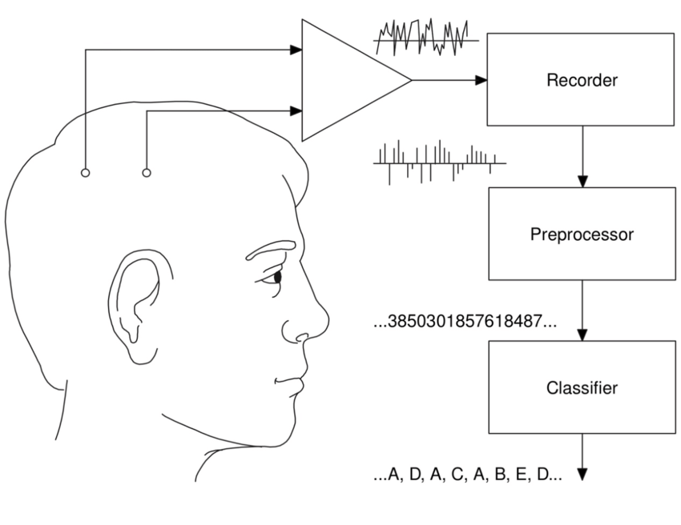
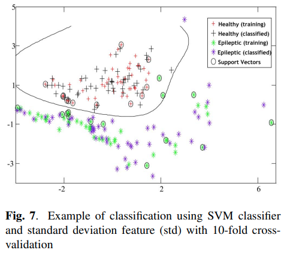

= Portfolio 🇺🇸
:keywords: Data Science, Machine Learning
:toc: auto

// Amine Hadj-Youcef, PhD 15/01/2023

== Introduction

* Amine HADJ-YOUCEF
* Senior Data Scientist / Machine Learning Engineer
* DATA + AI in Information technologie et services
* Industrie, Aéronautique & Spatiale, Ferroviaire

== Resume

* Docteur data Scientist, mon objectif est d’accompagner les clients sur
leurs projets data, de la définition du besoin jusqu’à la mise en
production, dans le but de résoudre des problématiques métiers concrets,
d’apporter de la valeur ajoutée et d’augmenter le chiffre d’affaires.
* J’attache de l’importance au transfert de connaissances par le biais
de l’encadrement et de la formation des juniors.

== Online Presence

[width="100%",cols="11%,89%",options="header",]
|===
|Website |URL
|Personnel |https://aminehy.github.io/
|LinkedIn |https://www.linkedin.com/in/aminehy/
|Medium |https://amine-hy.medium.com/
|Twitter |https://twitter.com/AmineHadjYoucef
|:email: |hadjyoucef.amine:rocket:gmail.com[hadjyoucef.amine@gmail.com]
|===

== Languages

[cols=",",options="header",]
|===
|Language |Level
|🇫🇷 French |Native
|🇺🇸 English |Native
|===

== Main Skills

[arabic]
. Définition du besoin métier et conseil sur la mise en place d’une
solution technique
. Data Science / Machine Learning
* Définition du besoin avec les équipes métiers
* Préparation et analyse des données
* Modélisation avec ou sans Machine learning
* Mise en production des solutions, en local ou sur le cloud
. Mentorat et formation professionnelle

== Technical Skills

[cols=",",options="header",]
|===
| |Tools
|Data Eng |Airtable, postgres, Delta Lake
|Data Vis |PowerBI, Tableau, Redash
|Big Data |Apache Spark, Azure Databricks
|Data Science |Python, SQL, NumPy, pandas, Apache Spark
|Machine Learning |Scikit-learn, HyperOpt, MLflow, Spark ML
|===

== Technical Skills

[cols=",",options="header",]
|===
| |Tools
|DevOps |Git, GitHub, Docker, Flask, FastAPI, Postman
|Cloud |Microsoft Azure, Amazon AWS, GCP
|Computer Vision |OpenCV, Tensorflow
|Gestion de Projet |Microsoft Teams, JIRA, Notion
|Data |PNG/JPG, MP4, JSON, CSV/Excel, XML, Delta
|===

== 🎓 Education

=== Education

* 🎓 Doctorat, Sciences et Technologies de l’Information
** 2018: Université Paris Saclay
* 🎓 Master, Traitement du Signal et de l’image
** 2015: Université de Bordeaux
* 🎓 Engénieur, Electrinic Degree
** 2021: Ecole Nationale Polytechnique (ENP)

== Certifications

* link:ressources\certificat_databricks_lakehouse.pdf[Academy
Accreditation - Databricks Lakehouse Fundamentals]
** 2022 : Databricks
* link:ressources/Hackmakers%20-%20Hackmakers%20BuildwithAI%202020%20Mentor%20Certificate%20-%202020-08-13.png[Hackmakers
#BuildwithAI Global Hack: Mentor Certificate]
** 2020: Hackmakers
* Deep Learning and Artificial Intelligence
** 2018: École Polytechnique Palaiseau

== Professional Experiences

=== SNCF Réseau

* Télédiagnostic des capteurs de surveillance des trains
* Dans le cadre du projet télédiagnostic des capteurs de contrôle de
vitesse, l’objectif est de développer des pipelines de traitements des
données massives pour la détection des pannes et l’industrialisation de
l’envoi automatique des alarmes au centre de supervision.
* Mise en place d’un pipeline d’ingestion des données en streaming
provenant des capteurs connectés en utilisant Azure Databricks (Delta
Live Table) et Apache Spark.
* Amélioration de la maintenance _des capteurs de la vitesse_ des trains
à travers l’industrialisation de pipeline de traitement des données
massives pour la détection de pannes et l’envoi automatique des alarmes
vers le centre de supervision (Databricks Workflows, Apache Spark,
Python, SQL).

* *Média* image:../images/Untitled%202.png[image, 250]
image:../images/Untitled%204.png[image, 300]
image:../images/Untitled%203.png[image, 250]
image:../images/Untitled%201.png[image, 200]

=== TAG Hueur - LVMH

* *Titre* : Amélioration des KPI de l’application running de la montre
_TAG Hueur Connected_
* *Description de la réalisation*
* *Solution du projet*:
* *URL du Projet*:
https://www.tagheuer.com/fr/fr/smartwatches/collection-connected.html[https://www.tagheuer.com/fr/fr/smartwatches]

* *Média* | image:../images/Untitled%205.png[Untitled] | |
:———————————-: | | image:../images/Untitled%206.png[Untitled] |

=== Drone Volt Group

* *Titre du projet* : Fire Detection using Deep Learning Deployed on
PENSAR
* *Description de la réalisation*
** The deep learning model for the detection of fire in a video. The
algorithm is embedded in the edge camera and runs in real-time.
** Collecting and annotating data to Training and testing a deep
learning model.
* *Solution du projet*
* *URL du Projet* : https://pensarsdk.com/

* *Média* | image:../images/Untitled%2010.png[Untitled] |
image:../images/Untitled%209.png[Untitled] | | :———————————–: |
:———————————-: | | image:../images/Untitled%207.png[Untitled] |
image:../images/Untitled%208.png[Untitled] |

=== IAS - LSS

* *Titre du projet* : Spatio-spectral reconstruction from multispectral
data. Application to the Mid-Infrared instrument of the JWST
* *Description de la réalisation* : In charge of innovating a data
processing solution for the JWST / NASA space telescope (14 countries,
budget> $ 10 billion)
* *Solution du projet*: …
* *URL du Projet* :
https://sci.esa.int/web/jwst/-/46826-miri-the-mid-infrared-instrument-on-jwst

* *Média* | image:../images/2022-10-18_22-36.png[2022-10-18_22-36.png] |
image:../images/2022-10-18_22-36_2.png[2022-10-18_22-36_2.png] | |
:————————————————–: | :——————————————————: | |
image:../images/Untitled%2012.png[Untitled] |
image:../images/Untitled%2011.png[Untitled] |

=== ENP

* *Titre du projet*:
* *Description de la réalisation*:
* *URL du Projet*: https://ieeexplore.ieee.org/abstract/document/6602363
* *Solution du projet*: …

* *Média* |

| image:../images/2022-10-18_22-39.png[2022-10-18_22-39.png] | |
:———————————————————————————-: | :————————————————–: | |
 |
image:../images/2022-10-18_22-41.png[image] |

== 📖 Publications

=== 📖 Publisher List

image::../logo/eurasip-logo-trans02.png[image, 70]
image::../logo/medium[image, 70]
image::../logo/IEEE[image, 70]
image::../logo/A_and_A[image, 70]
image::../logo/paris_saclay[image, 70]

=== 📖 Publication in Scientific Journals

* Hadj-Youcef, M. A., Orieux, F., Abergel, A., & Fraysse, A. (2020).
** Fast Joint Multiband Reconstruction From Wideband Images Based on
Low-Rank Approximation.
** IEEE Transactions on Computational Imaging, 6, 922–933.
* Boucaud, A., Bocchio, M., Abergel, A., Orieux, F., Dole, H., &
Hadj-Youcef, M. A. (2016).
** Convolution kernels for multi-wavelength imaging
** https://doi.org/10.1051/0004-6361/201629080

=== 📖 Publication dans des conférence internationaux

* Hadj-Youcef, M. A., Bousbia-Salah, A., & Adnane, M. (2018).
** Feature selection applied to wavelet packet transform for an
efficient EEG signal classification. 2018 International Conference on
Electrical Sciences and Technologies in Maghreb (CISTEM), 1–6.
* Hadj-youcef, M. A., & Abergel, A. (2017)
** Restauration d’objets astrophysiques à partir de données
multispectrales floues et une réponse instrument non stationnaire, Gdr
Isis, 123 (908), 2017

=== 📖 Publication dans des conférence internationaux

* Orieux, F., Fraysse, A., & Abergel, A. (2018). _Restoration from
Multispectral Blurred Data with Non-Stationary Instrument Response_.
_ii_, 1–5.
* Hadj-Youcef, M. E. (2018). _Spatio spectral reconstruction from
low-resolution multispectral data: application to the Mid-Infrared
instrument of the James Webb Space Telescope_. Université Paris-Saclay
(*ComUE*).

* Hadj-Youcef, M. A., Orieux, F., Fraysse, A., & Abergel, A. (2018).
Spatio-spectral multichannel reconstruction from few low-resolution
multispectral data. _2018 26th European Signal Processing Conference
(*EUSIPCO*)_, 1980–1984.
* Hadj-Youcef, M. A., Adnane, M., & Bousbia-Salah, A. (2013). Detection
of epileptics during seizure-free periods. _2013 8th International
Workshop on Systems, Signal Processing and Their Applications, *WoSSPA*
2013_, _May_, 209–213. https://doi.org/10.1109/WoSSPA.2013.6602363

=== 📖 Publication dans Medium

* https://towardsdatascience.com/convolutional-neural-network-for-image-classification-with-implementation-on-python-using-pytorch-7b88342c9ca9[Convolutional Neural Network for image Classification with implementation on python using pytorch]
* https://towardsdatascience.com/have-you-optimized-your-deep-learning-model-before-deployment-cdc3aa7f413d[Have you optimized your deep learning model before deployment?]
* https://medium.com/swlh/pensar-sdk-1-647f778bc11[Pensar SDK]
* https://towardsdatascience.com/how-to-write-and-publish-a-research-paper-3692550a5c5d[How to write and publish a research paper]
* https://towardsdatascience.com/simplify-your-data-science-project-with-this-tool-c493b9970280[Simplify-your-data-science-project-with-this-tool]
* https://towardsdatascience.com/how-to-package-a-python-application-using-anaconda-and-docker-fc752ce47729[How-to-package-a-python-application-using-anaconda-and-docker]
* https://amine-hy.medium.com/model-centric-vs-data-centric-view-in-the-age-of-ai-b59c15a53fc4[Model-centric-vs-data-centric-view-in-the-age-of-ai]
* https://amine-hy.medium.com/data-visualization-using-redash-on-the-cloud-63f6d4f2f1ef[Data-visualization-using-redash-on-the-cloud]

=== 📖 Poster de conférence

* link:../GRETSI_poster.pdf.2017_08_08_17_compressed.pdf[Poster GRETSI 2017]
