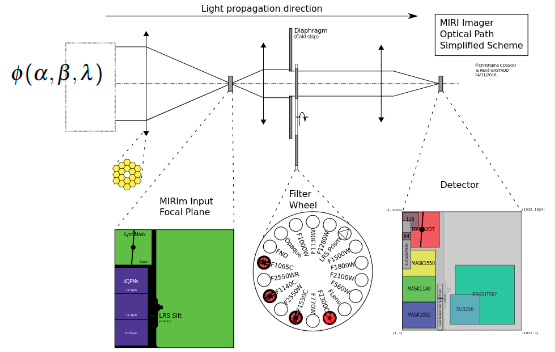
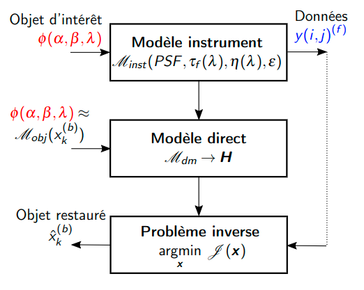

= Portfolio FR
:keywords: Data Science, Machine Learning
:toc: auto

Amine Hadj-Youcef. PhD Senior Data Scientist & Machine Learning

== Introduction

* Docteur Data Scientist, mon objectif est d’accompagner les clients sur
leurs projets data, de la définition du besoin jusqu’à la mise en production, dans le but de résoudre des problématiques métiers concrets,
d’apporter de la valeur ajoutée et d’augmenter le chiffre d’affaires.
* J’attache de l’importance au transfert de connaissances par le biais
de l’encadrement et de la formation des juniors.

== Compétence principales

[arabic]
. Conseil et accompagnement des équipe métiers
* Définition du besoin avec les équipes métiers
* Traduction du besoin métier en une solution technique
. Développement de solutions techniques en Data Science & Machine
Learning
* Collecte, ingestion, filtrage, enrichissement, analyse et exploration
des données
* Conception de dashboard analytiques pour mettre la data en valeur
* Modélisation et mise en production des solutions ML sur le cloud
. Leadership, mentorat et management
* Suivie, orientation et gestion de projet
* Respect des deadlines et objectifs des projets

== Compétence Techniques

[cols="35%,65%", width=80%]
|===
|Data Science |Python, SQL, NumPy, pandas, Apache Spark
|Machine Learning |Scikit-learn, AWS Sagemaker, HyperOpt, MLflow
|Data Engineering |Airtable, postgres, Delta Lake
|Data Visualisation |PowerBI, Tableau, Redash
|Big Data |Apache Spark, Azure Databricks
|DevOps |Git, GitHub, Docker, Flask, FastAPI, Postman
|Cloud |Microsoft Azure, AWS, GCP
|Computer Vision |OpenCV, Tensorflow
|Gestion de Projet |Microsoft Teams, JIRA, Notion
|===

image::https://www.graduateprogram.org/wp-content/uploads/2020/08/Aug-6-What-are-the-Advantages-of-a-Doctorate-Degree-in-Education__web.jpg[height=300]

== Formations

* 🎓 Doctorat, Sciences et Technologies de l’Information
** 2018: Université Paris-Saclay
* 🎓 Master, Traitement du Signal et de l’image
** 2015: Université de Bordeaux
* 🎓 Ingénieur, Électronique
** 2012: Ecole Nationale Polytechnique (ENP)

== Certifications

* link:../certificats_badges/certificat_databricks_lakehouse.pdf[Academy
Accreditation - Databricks Lakehouse Fundamentals]
** 2022 : Databricks
* link:../certificats_badges/Hackmakers%20-%20Hackmakers%20BuildwithAI%202020%20Mentor%20Certificate%20-%202020-08-13.png[Hackmakers
#BuildwithAI Global Hack: Mentor Certificate]
** 2020: Hackmakers
* Deep Learning and Artificial Intelligence
** 2018: École Polytechnique Palaiseau

==  Expériences professionnelles

image::https://assets.website-files.com/5d07afe28195606a40dc5223/5df7601d5d5668d49c44fa22_Two-SNCF-TGV-Trains.jpg[height=300]

===  SNCF

image::https://upload.wikimedia.org/wikipedia/fr/e/ec/Logo_SNCF_R%C3%A9seau_2015.svg[height=100]

* Senior Data Scientist - Ingénieur Machine Learning
* Paris, France
* 2020-2022

* _SNCF Réseau_ est une entreprise Française responsable de la
maintenance et la sécurité du réseau ferroviaire dans toute la France. A
travers le programme de supervision et de surveillance, la DGII assure
la maintenance du réseau et la régénération des équipements. Des données
massives sont collectées tous les jours par des capteurs connectés
indiquant different mesures: vitesse des trains, températures des rails,
état des appareils de voies,…

* Mon role de Data Scientist au sein de l’équipe _Data Science et
Décision_ est d’accompagner les différents équipes métier à définir le
besoin, développer des solutions techniques adaptés au besoin, et
d’assurer la communication sur le sujet avec les différents acteur du
projet.

* Parmi les taches réalisées:
** J’ai facilité l’accès aux données massives, nettoyées et enrichies,
par la mise en place des pipelines d’ingestion sur le Lakehouse
** Conception de dashboards interactives sur Power BI
** Amélioration de la maintenance _des capteurs de la vitesse_ des
trains par la détection de pannes et l’envoi automatique des alarmes
vers le centre de supervision
** Automatisation de la détection d’anomalie des capteurs par
l’industrialisation d’un algorithme de clustering des données
** Traitement des données massives provenant des boites noires des
trains

*Tech*: Apache Spark, Python, SQL, Databricks (Delta Live Table,
Workflows), AWS, Azure, mlflow

image:../images/Untitled%202.png[height=300]
image:../images/Untitled%203.png[height=300]

image::https://luxshopping.vn/Uploads/UserFiles/images/dong-ho-TAG-Heuer-Connected-Modular-45-%E2%80%98Golf-Edition%E2%80%99%208.jpg[height=300]

===  TAG Hueur - LVMH

image::https://upload.wikimedia.org/wikipedia/commons/5/57/TAG_HEUER_logo.svg[h=100]

* Data Scientist - Data Engineer
* Paris, France
* 2020

* TAG Heuer est un horloger de luxe suisse qui conçoit, fabrique et
commercialise des montres et des accessoires de mode. Dans le but
d’élargir la gamme de ses produit, TAG Hueur a lancé au marché un
nouveau modèle de montre intelligente de luxe, connectées, adaptés pour
les activités sportives (running, swimming, gulf). Dotée de différentes
capteurs (WiFi, GPS, Podomètre, Cardiogramme), la montre embarque
différents algorithmes pour traiter les données mesurées en temps réels,
et calculer des métriques de sports.

* Mon role dans l’équipe Traitement du signal est de proposer des
algorithmes de détection d’outlier causer par la perte du signal GPS,
afin d’amélioration des KPI de l’application de la montre link:https://www.tagheuer.com/fr/fr/smartwatches/collection-connected.html[_TAG Hueur Connected_]

* En tant que Data Scientist, j’ai réalisé les taches suivantes:
** Traitement, nettoyage, préparation, analyse de données du capteurs
(GPS…)
** Développement d’algorithme machine learning pour détecter les
anomalies
** Conception d’une application web pour interagir avec les algorithmes
développées
** Communication des résultats et participation aux réunions

*Tech*: Python (pandas, Numpy, scikit-learn), Docker, Streamlit

image:../images/Untitled%206.png[bg h:250]
image:../images/Untitled%205.png[bg h:240]

image::https://www.dronevolt.com/wp-content/uploads/2020/01/h10site-1024x621.jpg[height=300]

===  Drone Volt

* Ingénieur IA - Computer Vision
* Villepinte, France
* 2019

image::https://fra1.digitaloceanspaces.com/aircosmos/media/5d35c2c0d06eb04c0262988cf36ebe7bb51ae13e3c3490e430e2902a92572166.png[height=300]

* DRONE VOLT est un acteur international reconnu dans le domaine des
drones civils professionnels et l’intelligence artificielle embarquée.
Après l’acquisition d’Aérialtronics, Drone Volt a lancé une nouvelle
caméra intelligente, link:https://pensarsdk.com/[PENSAR].
* Descriptif du produit : https://pensarsdk.com/

* En tant qu’ingénieur IA - Computer Vision, j’ai réalisé les taches
suivantes:
** Collectes, préparation et annotation des images pour entraîner le
modèle deep learning
** Entraînement du modèle deep learning pour la détection du feu en
temps réel
** Travail d’équipe agile pour le développement du SDK de la caméra
** Rédaction de la documentation technique de la solution IA
** Formation de l’équipe commerciale du DRONE VOLT sur l’intelligence
artificielle
** Présentation de la solution aux clients et investisseurs du groupe

image:../images/Untitled%2010.png[w:500]
image:../images/Untitled%209.png[w:500]

image:../images/Untitled%207.png[w:500]
image:../images/Untitled%208.png[w:500]

image::https://cdn.hswstatic.com/gif/jwst-vs-hubble-1200x800.jpg[height=300]

===  IAS

image::https://assets9.domestika.org/project-covers/000/056/879/56879-original-78247-original-IAS_principal.jpg?1343660766[height=300]

* Ingénieur Machine Learning - Traitement d’image
* Orsay, France
* 2015-2018
* Porteur du projet:

image:https://upload.wikimedia.org/wikipedia/commons/e/e5/NASA_logo.svg[h=100]image:https://upload.wikimedia.org/wikipedia/commons/8/80/ESA_logo.svg[h=100]image:https://upload.wikimedia.org/wikipedia/en/7/77/Canadian_Space_Agency_logo.svg[h=100]

image:https://upload.wikimedia.org/wikipedia/commons/5/50/James_Webb_Space_Telescope.jpg[height=300] James-Webb Space Telescope (JWST) est un télescope spatial servant d’observatoire fonctionnant principalement dans l’infrarouge,
développé par la NASA avec la participation de l’Agence spatiale
européenne (ESA) et de l’Agence spatiale canadienne (ASC). Plus grand et
plus onéreux télescope spatial à son lancement, le JWST est conçu pour
poursuivre les travaux du télescope spatial Hubble,

Les principales objectifs de la mission
link:https://sci.esa.int/web/jwst/-/46826-miri-the-mid-infrared-instrument-on-jwst[JWST]
est d’étudier la formation et évolution des galaxies, de plus, la
compréhension de la formation des étoiles et les systèmes planétaires.

Le JWST est doté d’un imageur infrarouge (MIRI) permettant de mesurer
des observation dans un milieu infrarouge 5.6-7 microns. Divers
problèmes sont rencontrés lors des mesures Limitation de la résolution
spatiale par

A cause des limites physique, la réponse optique des miroirs limite la
résolution spatiale des images, et dépend de λ. De plus, le contenu
spectrale de l’objet observé est intégré sur une large bande spectrale
(filtre + détecteur)

* Mon objectif en tant qu’Ingénieur de traitement d’image / Machine
Learning est de reconstruire objet spatio-spectral original en
exploitant l’ensemble de données à différentes bandes spectrales
** Proposition d’un modèle instrument de l’imageur infrarouge, prenant
en compte la variation en λ de la PSF et de large intégration spectrale
** Proposition d’un modèle direct par un traitement conjoint de données
multi-filtre/instrument et choix du modèle linéaire par morceau
** Augmentation de résolution spatial et de l’information spectrale

image:../images/Untitled%2011.png[height=300]

image:../images/Untitled%2012.png[height=300]

image::https://assets.newatlas.com/dims4/default/47396f4/2147483647/strip/true/crop/5646x3764+0+0/resize/1440x960!/quality/90/?url=http:%2F%2Fnewatlas-brightspot.s3.amazonaws.com%2F50%2F86%2Ffbab5065408aa969de02585542bb%2Fdepositphotos-163337952-xl-2015.jpg[height=300]

===  ENP

image::https://upload.wikimedia.org/wikipedia/fr/3/35/Logo_Ecole_Nationale_Polytechnique_ENP.jpg[h=100]

* Ingénieur Machine Learning
* Alger, Algérie
* 2013

image::https://cablab.umn.edu/sites/cablab.umn.edu/files/2019-07/Research%20methods%20EEG.jpg[height=300]

L’objectif du projet est de développer une méthode de détection des
épilepsies (en état de repos), qui soit assimilable à un diagnostic
précoce de la maladie. Cette méthode peut être utilisée comme un outil
de diagnostic assisté par ordinateur par les praticiens de la
neurophysiologie. Cela permettra d’anticiper le traitement de la
pathologie et de protéger le patient en cas de crises d’épilepsie.

En tant qu’ingénieur en machine learning, j’ai travaillé sur un sujet de
classification des signaux Electro-encéphalogramme (EEG) pour la
détection d’épilepsie.

* Etude de l’état de l’art et comparaison entre les méthodes dans la
littérature
* Préparation et analyse de données
* Concevoir une chaîne de traitement des séries temporelles basé sur le
machine learning et la transformation en ondelettes sous Matlab
* Obtention de très bon résultat de classification par rapport à l’état
de l’art (précision >90%)
* Pour plus de détail :
** https://ieeexplore.ieee.org/abstract/document/6602363

image:../images/2022-10-18_22-39.png[height=300]
image:../images/2022-10-18_22-40.png[height=300]

== 📖 Publication

image:../logo/eurasip-logo-trans02.png[h:70]
image:https://upload.wikimedia.org/wikipedia/commons/3/3d/Logo_Universit%C3%A9_Paris-Saclay.svg[h:70]
image:https://upload.wikimedia.org/wikipedia/commons/2/21/IEEE_logo.svg[h:70]
image:../logo/A_and_A[h:70]
image:https://upload.wikimedia.org/wikipedia/commons/a/a5/Medium_icon.svg[h:70]

=== 📖 Publication dans des journaux scientifiques

* Hadj-Youcef, M. A., Orieux, F., Abergel, A., & Fraysse, A. (2020).
Fast Joint Multiband Reconstruction From Wideband Images Based on
Low-Rank Approximation. IEEE Transactions on Computational Imaging, 6,
922–933.
* Boucaud, A., Bocchio, M., Abergel, A., Orieux, F., Dole, H., &
Hadj-Youcef, M. A. (2016). _Convolution kernels for multi-wavelength
imaging_. _October_, 7. https://doi.org/10.1051/0004-6361/201629080

=== 📖 Publication dans des conférence internationaux

* Hadj-Youcef, M. A., Bousbia-Salah, A., & Adnane, M. (2018). Feature
selection applied to wavelet packet transform for an efficient EEG
signal classification. 2018 International Conference on Electrical
Sciences and Technologies in Maghreb.
* Hadj-youcef, A. (2014). Reconstruction des Images par des méthodes
d’optimisation convexes et non lisses.
* Hadj-youcef, M. A., & Abergel, A. (2017). Restauration d’objets
astrophysiques à partir de données multispectrales floues et une réponse
instrument non stationnaire. Gdr Isis, 123(908), 2017.
* Orieux, F., Fraysse, A., & Abergel, A. (2018).Restoration from
Multispectral Blurred Data with Non-Stationary Instrument Response. ii,
1–5.

* Hadj-Youcef, M. E. (2018). Spatio spectral reconstruction from
low-resolution multispectral data: Application to the Mid-Infrared
instrument of the James Webb Space Telescope. Université Paris-Saclay
(ComUE).
* Hadj-Youcef, M. A., Orieux, F., Fraysse, A., & Abergel, A. (2018).
Spatio-spectral multichannel reconstruction from few low-resolution
multispectral data. 2018 26th European Signal Processing Conference
(EUSIPCO), 1980–1984.
* Hadj-Youcef, M. A., Adnane, M., & Bousbia-Salah, A. (2013). Detection
of epileptics during seizure-free periods. 2013 8th International
Workshop on Systems, Signal Processing and Their Applications, WoSSPA
2013, May, 209–213. https://doi.org/10.1109/WoSSPA.2013.6602363

=== 📖 Publication dans Medium

* https://towardsdatascience.com/convolutional-neural-network-for-image-classification-with-implementation-on-python-using-pytorch-7b88342c9ca9[Convolutional
neural network for image classification with implementation on python
using pytorch]
* https://towardsdatascience.com/have-you-optimized-your-deep-learning-model-before-deployment-cdc3aa7f413d[Have
you optimized your deep learning model before deployment]
* https://medium.com/swlh/pensar-sdk-1-647f778bc11[Pensar-sdk]
* https://towardsdatascience.com/how-to-write-and-publish-a-research-paper-3692550a5c5d[How
to write and publish a research paper]
* https://towardsdatascience.com/simplify-your-data-science-project-with-this-tool-c493b9970280[Simplify
your data science project with this tool]
* https://towardsdatascience.com/how-to-package-a-python-application-using-anaconda-and-docker-fc752ce47729[How
to package a python application using anaconda and docker]
* https://amine-hy.medium.com/model-centric-vs-data-centric-view-in-the-age-of-ai-b59c15a53fc4[Model
centric vs data centric view in the age of ai]
* https://amine-hy.medium.com/data-visualization-using-redash-on-the-cloud-63f6d4f2f1ef[Data
visualization using redash on the cloud]

=== 📖 Poster de conférence

* link:../GRETSI_poster.pdf.2017_08_08_17_compressed.pdf[Poster GRETSI
2017]

=== Contactez moi 🇫🇷 / 🇺🇸

* https://www.linkedin.com/in/aminehy/[image:https://upload.wikimedia.org/wikipedia/commons/b/b1/LinkedIn_Logo_2013_%282%29.svg[h=100]]
* https://twitter.com/AmineHadjYoucef[image:https://upload.wikimedia.org/wikipedia/commons/4/4f/Twitter-logo.svg[h=100]]
* https://amine-hy.medium.com/[image:https://upload.wikimedia.org/wikipedia/commons/a/a5/Medium_icon.svg[h=100]]
* https://github.com/amineHY[image:https://upload.wikimedia.org/wikipedia/commons/9/95/Font_Awesome_5_brands_github.svg[h=100]]
* mailto:hadjyoucef.amine@gmail.com[image:https://upload.wikimedia.org/wikipedia/commons/7/7e/Gmail_icon_%282020%29.svg[h=100]]