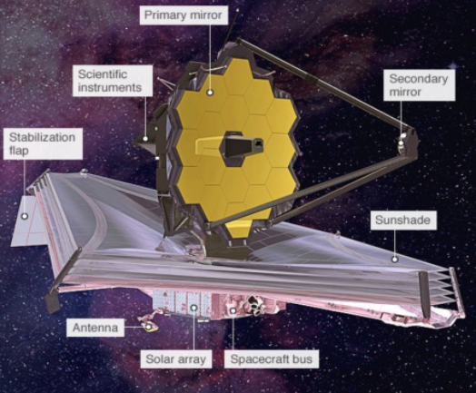
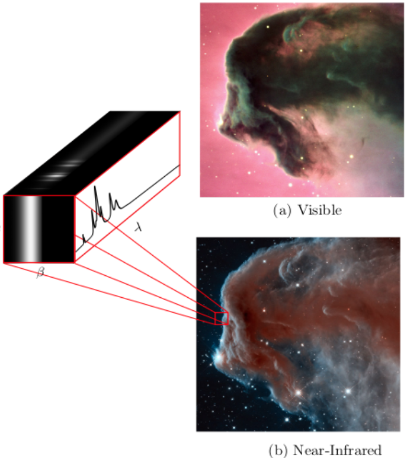

# Portfolio 🇫🇷
---
- [# Portfolio 🇫🇷](#-portfolio-)
- [Résumé](#résumé)
- [Socials](#socials)
- [Langues](#langues)
- [Compétence Clés](#compétence-clés)
- [Compétence Techniques](#compétence-techniques)
- [Formations](#formations)
    - [🎓 Doctorat, Sciences et Technologies de l’Information](#-doctorat-sciences-et-technologies-de-linformation)
    - [🎓 Master, Traitement du Signal et de l'image](#-master-traitement-du-signal-et-de-limage)
- [Certifications](#certifications)
- [Réalisations](#réalisations)
  - [@ SNCF Réseau](#-sncf-réseau)
  - [@ TAG Hueur - LVMH](#-tag-hueur---lvmh)
  - [@ Drone Volt Group](#-drone-volt-group)
  - [@ IAS - LSS](#-ias---lss)
  - [@ ENP](#-enp)
- [Liste de publication scientifique](#liste-de-publication-scientifique)
  - [📖 Publication dans des journaux scientifiques](#-publication-dans-des-journaux-scientifiques)
  - [📖 Publication dans des conférence internationaux](#-publication-dans-des-conférence-internationaux)
  - [📖 Publication dans Medium](#-publication-dans-medium)
  - [📖 Poster de conférence](#-poster-de-conférence)

---

| Domaine       | Outils                                                                          |
| ------------- | ------------------------------------------------------------------------------- |
| Nom et Prénom | HADJ-YOUCEF Amine  |
| Fonction      | Senior Data Scientist / Solution Engineer                                       |
| Secteur       | Information technologie et services                                             |
| Domaine       | Industrie, Aéronautique & Spatiale, Ferroviaire                                 |

## Résumé

- Docteur data Scientist, mon objectif est d'accompagner les clients sur leurs projets data, de la définition du besoin jusqu'à la mise en production, dans le but de résoudre des problématiques métiers concrets, d'apporter de la valeur ajoutée et d'augmenter le chiffre d'affaires.
- J’attache de l’importance au transfert de connaissances par le biais de l’encadrement et de la formation des juniors.

## Socials

| Website   | URL                                                                          |
| --------- | ---------------------------------------------------------------------------- |
| Personnel | [https://aminehy.github.io/](https://aminehy.github.io/)                     |
| LinkedIn  | [https://www.linkedin.com/in/aminehy/](https://www.linkedin.com/in/aminehy/) |
| Medium    | [https://amine-hy.medium.com/](https://amine-hy.medium.com/)                 |
| Twitter   | [https://twitter.com/AmineHadjYoucef](https://twitter.com/AmineHadjYoucef)   |
| Email     | [hadjyoucef.amine@gmail.com](hadjyoucef.amine@gmail.com)                                                   |

## Langues

| Langue      | Niveau  |
| ----------- | ------- |
| 🇫🇷 Français | Courant |
| 🇺🇸 Anglais  | Courant |

## Compétence Clés

1. Définition du besoin métier et conseil sur la mise en place d’une solution technique
2. Data Science / Machine Learning

   - Définition du besoin avec les équipes métiers
   - Préparation et analyse des données
   - Modélisation avec ou sans Machine learning
   - Mise en production des solutions, en local ou sur le cloud,
   - Recherche et développement

3. Mentorat et formation professionnelle

## Compétence Techniques

| Domaine           | Outils                                       |
| ----------------- | -------------------------------------------- |
| OS                | Linux, Windows                               |
| Data Eng          | Airtable, postgres, Delta Lake               |
| Data Vis          | PowerBI, Tableau, Redash                     |
| Big Data          | Apache Spark, Azure Databricks               |
| Data Science      | Python, SQL, NumPy, pandas, Apache Spark     |
| Machine Learning  | Scikit-learn, AWS Sagemaker, HyperOpt        |
| MLOps             | MLflow                                       |
| DevOps            | Git, GitHub, Docker, Flask, FastAPI, Postman |
| Cloud             | Microsoft Azure, AWS, GCP                    |
| Computer Vision   | OpenCV, Tensorflow                           |
| NLP               | Spicy, NLTK                                  |
| Gestion de Projet | Microsoft Teams, JIRA, Notion                |
| Data              | PNG/JPG, MP4, JSON, CSV/Excel, XML, Delta    |

## Formations

#### 🎓 Doctorat, Sciences et Technologies de l’Information
  - Université Paris Saclay
  - 2018

#### 🎓 Master, Traitement du Signal et de l'image
  - Université de Bordeaux
  - 2015

## Certifications

- [Academy Accreditation - Databricks Lakehouse Fundamentals](ressources\certificat_databricks_lakehouse.pdf)
  - Databricks
  - 2022
- [Hackmakers #BuildwithAI Global Hack: Mentor Certificate](ressources/Hackmakers%20-%20Hackmakers%20BuildwithAI%202020%20Mentor%20Certificate%20-%202020-08-13.png)
  - Hackmakers
  - 2020
- Deep Learning and Artificial Intelligence
  - École Polytechnique
  - 2018

## Réalisations

###  @ SNCF Réseau

- **Titre** : Télédiagnostic des capteurs de surveillance des trains

- **Description de la réalisation** : Dans le cadre du projet télédiagnostic des capteurs de contrôle de vitesse, l’objectif est de développer des pipelines de traitements des données massives pour la détection des pannes et l’industrialisation de l’envoi automatique des alarmes au centre de supervision.

- **Solution du projet**:

  - Mise en place d’un pipeline d'ingestion des données en streaming provenant des capteurs connectés en utilisant Azure Databricks (Delta Live Table) et Apache Spark.
  - Amélioration de la maintenance _des capteurs de la vitesse_ des trains à travers l’industrialisation de pipeline de traitement des données massives pour la détection de pannes et l’envoi automatique des alarmes vers le centre de supervision (Databricks Workflows, Apache Spark, Python, SQL).

- **Média**
  |  |  |
  | :----------------------------------: | :----------------------------------: |
  |  |  |

###  @ TAG Hueur - LVMH

- **Titre** : Amélioration des KPI de l’application running de la montre _TAG Hueur Connected_

- **Description de la réalisation**
- **Solution du projet**:
- **URL du Projet**: [https://www.tagheuer.com/fr/fr/smartwatches](https://www.tagheuer.com/fr/fr/smartwatches/collection-connected.html)

- **Média**
  |  |
  | :----------------------------------: |
  |  |

###  @ Drone Volt Group

- **Titre du projet** : Fire Detection using Deep Learning Deployed on PENSAR

- **Description de la réalisation**

  - The deep learning model for the detection of fire in a video. The algorithm is embedded in the edge camera and runs in real-time.
  - Collecting and annotating data to Training and testing a deep learning model.

- **Solution du projet**

- **URL du Projet** : [https://pensarsdk.com/](https://pensarsdk.com/)

- **Média**
  |  |  |
  | :-----------------------------------: | :----------------------------------: |
  |  |  |

###  @ IAS - LSS

- **Titre du projet** : Spatio-spectral reconstruction from multispectral data. Application to the Mid-Infrared instrument of the JWST

- **Description de la réalisation** : In charge of innovating a data processing solution for the JWST / NASA space telescope (14 countries, budget> $ 10 billion)

- **Solution du projet**: ...
- **URL du Projet** : [https://sci.esa.int/web/jwst/-/46826-miri-the-mid-infrared-instrument-on-jwst](https://sci.esa.int/web/jwst/-/46826-miri-the-mid-infrared-instrument-on-jwst)

- **Média**
  |  |  |
  | :--------------------------------------------------: | :------------------------------------------------------: |
  |  |  |

###  @ ENP

- **Titre du projet**:

- **Description de la réalisation**:

- **URL du Projet**: [https://ieeexplore.ieee.org/abstract/document/6602363](https://ieeexplore.ieee.org/abstract/document/6602363)

- **Solution du projet**: ...

- **Média**
  |  |  |
  | :----------------------------------------------------------------------------------: | :--------------------------------------------------: |
  |  |  |

## Liste de publication scientifique

| EURASIP                                                                 | Medium                                                | IEEE                                                | A&A                                                    | Paris Saclay                                                |
| ----------------------------------------------------------------------- | ----------------------------------------------------- | --------------------------------------------------- | ------------------------------------------------------ | ----------------------------------------------------------- |
|  |  |  |  |  |

### 📖 Publication dans des journaux scientifiques

- Hadj-Youcef, M. A., Orieux, F., Abergel, A., & Fraysse, A. (2020). Fast Joint Multiband Reconstruction From Wideband Images Based on Low-Rank Approximation. IEEE Transactions on Computational Imaging, 6, 922–933.

- Boucaud, A., Bocchio, M., Abergel, A., Orieux, F., Dole, H., & Hadj-Youcef, M. A. (2016). _Convolution kernels for multi-wavelength imaging_. _October_, 7. [https://doi.org/10.1051/0004-6361/201629080](https://doi.org/10.1051/0004-6361/201629080)

### 📖 Publication dans des conférence internationaux

- Hadj-Youcef, M. A., Bousbia-Salah, A., & Adnane, M. (2018). Feature selection applied to wavelet packet transform for an efficient EEG signal classification. _2018 International Conference on Electrical Sciences and Technologies in Maghreb (**CISTEM**)_, 1–6.

- Hadj-youcef, A. (2014). _Reconstruction des Images par des méthodes d’optimisation convexes et non lisses_.

- Hadj-youcef, M. A., & Abergel, A. (2017). Restauration d’objets astrophysiques à partir de données multispectrales floues et une réponse instrument non stationnaire. **_Gdr Isis_**, _123_(908), 2017.

- Orieux, F., Fraysse, A., & Abergel, A. (2018). _Restoration from Multispectral Blurred Data with Non-Stationary Instrument Response_. _ii_, 1–5.

- Hadj-Youcef, M. E. (2018). _Spatio spectral reconstruction from low-resolution multispectral data: application to the Mid-Infrared instrument of the James Webb Space Telescope_. Université Paris-Saclay (**ComUE**).

- Hadj-Youcef, M. A., Orieux, F., Fraysse, A., & Abergel, A. (2018). Spatio-spectral multichannel reconstruction from few low-resolution multispectral data. _2018 26th European Signal Processing Conference (**EUSIPCO**)_, 1980–1984.

- Hadj-Youcef, M. A., Adnane, M., & Bousbia-Salah, A. (2013). Detection of epileptics during seizure-free periods. _2013 8th International Workshop on Systems, Signal Processing and Their Applications, **WoSSPA** 2013_, _May_, 209–213. [https://doi.org/10.1109/WoSSPA.2013.6602363](https://doi.org/10.1109/WoSSPA.2013.6602363)

### 📖 Publication dans Medium

- [Convolutional-neural-network-for-image-classification-with-implementation-on-python-using-pytorch](https://towardsdatascience.com/convolutional-neural-network-for-image-classification-with-implementation-on-python-using-pytorch-7b88342c9ca9)
- [Have-you-optimized-your-deep-learning-model-before-deployment](https://towardsdatascience.com/have-you-optimized-your-deep-learning-model-before-deployment-cdc3aa7f413d)
- [Pensar-sdk](https://medium.com/swlh/pensar-sdk-1-647f778bc11)
- [How-to-write-and-publish-a-research-paper](https://towardsdatascience.com/how-to-write-and-publish-a-research-paper-3692550a5c5d)
- [Simplify-your-data-science-project-with-this-tool](https://towardsdatascience.com/simplify-your-data-science-project-with-this-tool-c493b9970280)
- [How-to-package-a-python-application-using-anaconda-and-docker](https://towardsdatascience.com/how-to-package-a-python-application-using-anaconda-and-docker-fc752ce47729)
- [Model-centric-vs-data-centric-view-in-the-age-of-ai](https://amine-hy.medium.com/model-centric-vs-data-centric-view-in-the-age-of-ai-b59c15a53fc4)
- [Data-visualization-using-redash-on-the-cloud](https://amine-hy.medium.com/data-visualization-using-redash-on-the-cloud-63f6d4f2f1ef)

### 📖 Poster de conférence

- [Poster GRETSI 2017](../GRETSI_poster.pdf.2017_08_08_17_compressed.pdf)
